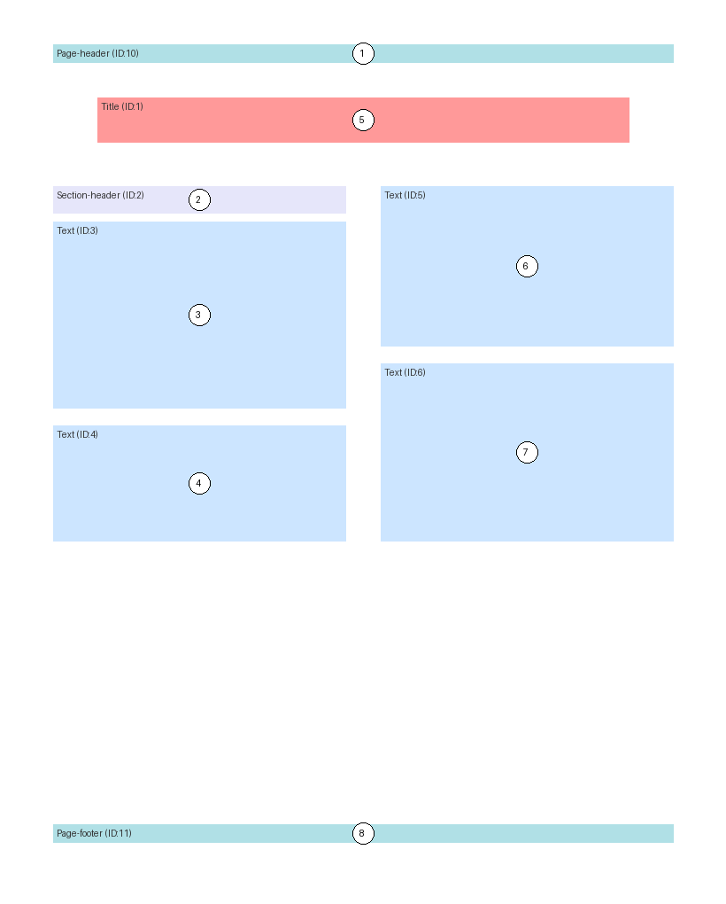
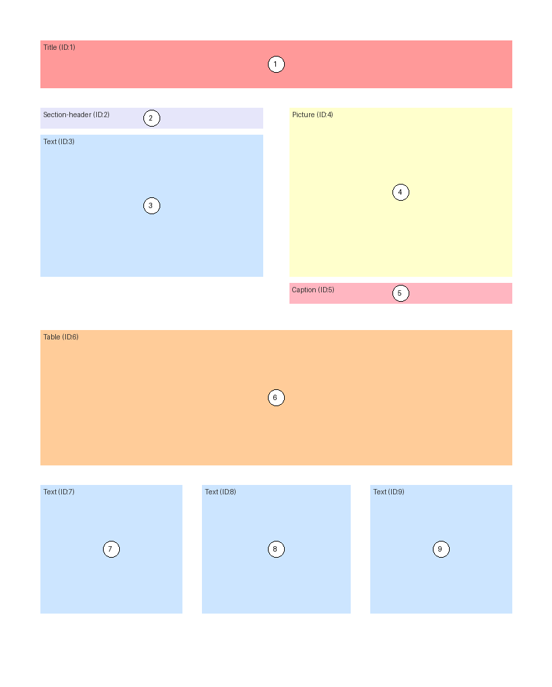

# XYCut++ Visual Scenarios Output

This page documents how to run `scenarios.py` and shows the generated output images for all included examples and backends.

## Run the visual scenarios

From `rust-bindings/xycutppy/tests`:

```bash
python scenarios.py
```

The script generates annotated layout images in:

```text
output_examples/
```

## Output gallery

### Academic paper layout

#### Backend: `paper`



#### Backend: `datalab`


### Dense newspaper layout

#### Backend: `paper`


#### Backend: `datalab`


